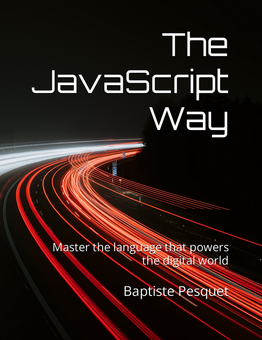

# O Caminho do Javascript
Uma introdução leve a uma linguagem essencial.
Copyright © 2017-present [Baptiste Pesquet](https://bpesquet.fr).

Esse repositório contém os arquivos do livro **The JavaScript Way** traduzidos para português.

Para ter acesso aos arquivos, acesse [manuscritos](manuscript/) ou [acesse o website](https://thejsway.net).

Esse livro também está disponível no [Leanpub](https://leanpub.com/thejsway) (PDF, EPUB), [Amazon](https://www.amazon.com/dp/295644462X) (Kindle, brochura) e [Educative](https://www.educative.io/courses/the-complete-javascript-course-build-a-real-world-app-from-scratch) (interactive course).

## Licença

Esse livro está sob licença [Creative Commons](LICENSE). Todos os códigos estão sob licença [MIT](CODE_LICENSE). [Contribuições](CONTRIBUTING.md) são muito bem-vindas.

