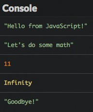
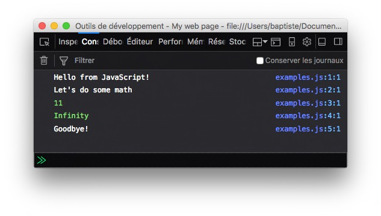
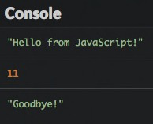
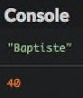

# 3, 2, 1... Codar!

Vamos começar! Esse capítulo vai te introduzir aos fundamentos da programação incluindo valores, tipos de valores e estrutura de programas.

## Seu primeiro programa

Esse é o seu primeiríssimo programa JavaScript.

```js
console.log("Olá do JavaScript!");
```

Esse programa exibe `"Olá do JavaScript!"` no **console**, uma área que mostra informação em texto e está disponível na maioria dos ambientes que suportam Javascript, a exemplo de navegadores.

Para executar essa tarefa, o programa utiliza um comando do JavaScript chamado `console.log()`, cujo papel é exibir informações. O texto a ser exibido é inserido entre os parêntesis, em seguida o ponto e vírgula marca o fim da linha.

Mostrar um texto na tela(o famoso [Olá Mundo](https://en.wikipedia.org/wiki/Hello_world) que todos os programadores conhecem) geralmente é a primeira coisa que você fará ao aprender uma nova linguagem de programação. É o exemplo clássico. Você já deu o primeiro passo!

## Valores e Tipos de Dados

Um **valor** é um fragmento de informação utilizada em um programa de computador. Valores têm diferentes formas, chamadas de tipos de dados. O **tipo** do valor determina seu papel e as operações disponíveis para ele.
Toda linguagem de programação tem seus próprios valores e tipos de dados. Vamos dar uma olhada em dois dos tipos de dados disponívels no JavaScript.

### Número

Um **número**(número) é um valor numérico(obrigada, capitão óbvio). Mas vamos além disso! Como na matemática, você pode usar números inteiros como 0, 1, 2, 3, etc, ou números reais com decimais para mais precisão. 

 Em programação, utilizamos o ponto ao invés da vírgula para escrever números com decimais. É `3.14` e não `3,14`!

Números geralmente são utilizados para fazer contas. As principais operações que você verá estão listadas na tabela abaixo. Todas elas geram um resultado numérico.


|Operador|Função|
|---------|----|
|`+`|Adição|
|`-`|Subtração|
|`*`|Multiplicação|
|`/`|Divisão|

### String

Uma **string** em JavaScript é um texto cercado por aspas, exemplo: `"Isso é uma string"`.
Você também pode utilizar um par de aspas simples: `'Isso é outra string'`. Boas práticas no uso de aspas simples ou duplas é uma questão política. Use o que você achar melhor, mas não misture os dois tipos no mesmo programa!
!!! aviso

    Lembre-se de sempre fechar uma string com o mesmo tipo de aspas que você utilizou no início.

Para incluir caracteres especiais em uma string, use o caractere `\` (*barra inversa*, também chamada de barra invertida ou contrabarra) antes do caractere desejado. Por exemplo, digite `\n` para adicionar uma nova linha dentro de uma string: `"Isso é\n uma string multilinha"`.
Não é possível adicionar ou subtrair valores string como se faz com números. No entando, o operador `+` tem um significado especial quando aplicado a dois valores strings. Ele une os dois textos e essa operação se chama **concatenação**(concatenation). Por exemplo, `"O" + "lá"` gera o resultado `"Olá"`.

## Estrutura de um programa

Nós já definimos um programa de computador como uma lista de comandos que dizem a um computador o que fazer. Essas ordens são escritas como de arquivos de texto e formam o que se chama "código fonte" de um programa.

O código fonte pode conter linhas vazias: elas serão ignoradas quando o programa é executado.

### Declarações

Cada instrução dentro de um programa é chamada de **declaração**. Uma declaração em JavaScript geralmente termina com **ponto e vírgula** (embora não seja estritamente obrigatório). Seu programa será composto de uma série dessas declarações.
!!! dica

    Geralmente só se escreve uma declaração por linha.

### Fluxo de execução

Quando um programa é executado, as declarações nele são "lidas" uma após a outra. É a combinação desses resultados individuais que produz o resultado final do programa.
 
Esse é um exemplo de um programa em Javascript com várias declarações, seguido do resultado da sua execução.

```js
console.log("Olá do JavaScript!");
console.log("Vamos fazer uns cálculos!");
console.log(4 + 7);
console.log(12 / 0);
console.log("Tchau!");
```



A depender do seu ambiente de trabalho, o resultado da execução pode não incluir aspas ao redor do texto.



!!! nota

    Como esperado, a divisão por zero(`12/0`) resulta no valor `Infinito`.

### Comentários

Por padrão, cada linha de texto no código fonte de um programa é considerada uma declaração a ser executada. Você pode impedir que linhas sejam executadas inserindo duas barras no início delas: `//`. Isso transforma o código em um **comentário**.

```js
console.log("Olá do JavaScript!");
// console.log("Vamos fazer uns cálculos!");
console.log(4 + 7);
// console.log(12 / 0);
console.log("Tchau!");
```

Durante a execução, as linhas transformadas em comentários não produzem mais resultados. Como esperávamos, elas não foram executadas.



Comentários são ótimos para desenvolvedores, você pode escrever comentários para si mesmo, explicações sobre seu código e mais, sem que o computador execute nada disso.

Você também pode escrever comentários escrevendo `/*  */` em volta do código que você quer transformar em comentário.

```js
/* Um comentário
escrito em 
várias linhas */

// Um comentário de uma linha
```

Comentários são uma ótima fonte de informação sobre o propósito ou estrutura de um programa. Adicionar comentários a partes críticas ou complicadas é um bom hábito que você deve construir desde já!

## TL;DR

* O comando `console.log()` do JavaScript mostra uma mensagem no **console**, uma zona de informação disponível na maioria dos ambientes JavaScript.

* Um **valor**(value) é uma fragmento de informação. O **tipo** do valor define seu papel e as operações aplicadas a ele.

* A linguagem JavaScript usa o tipo **número** para representar um valor numérico(com ou sem decimais) e o tipo **string** type para representar texto.

* Um valor string é cercado por aspas simples (`'...'`) ou por aspas duplas (`"..."`).

* Operações aritméticas entre números são realizadas com os operadores `+`, `-`, `*` e `/`. O operador `+` une duas strings. Essa operação é chamada **concatenação**.

* Um programa de computador é formado por várias **linhas de código** lidas sequencialmente durante a execução.

* **Comentários** (`// ...` ou `/* ... */`) são partes não executáveis de código. Eles formam documentações úteis sobre o programa.

## Hora de codar!

Vamos colocar em prática suas novas habilidades de programação.

### Apresentação

Escreva um programa que exibe seu nome e idade. Esse é o resultado do meu:



### Calculadora minimalista

Escreva um programa que mostra o resultado de adição, subtração, multiplicação e divisão de 6 por 3.

### Previsão de valores

Observe o programa a seguir e tente prever o valor que será exibido.

```js
console.log(4 + 5);
console.log("4 + 5");
console.log("4" + "5");
```

Execute o programa para verificar se sua previsão está correta.