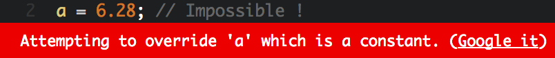
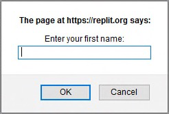
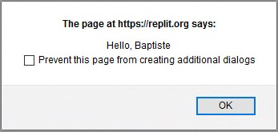

# Brinque com variáveis

Agora você sabe como usar Javscript para exibir informações. Contudo, para um programa ser útil de verdade, ele precisa ser capaz de armazenar dados, como informações inseridas por um usuário. Vamos dar uma olhada.

## Variáveis

### Papel de um variável

Um programa de computador armazena dados usando variáveis. Uma **variável** é uma área de armazenamento de informações. Podemos imaginá-la como uma caixa na qual você pode inserir e armazenar coisas!

### Propriedades de variáveis

Uma variável tem três propriedades principais:

* Seu **nome**, que a identifica. O nome de uma variável pode conter letras maiúsculas e minúsculas, números(não na primeira posição) e caracteres como o cifrão(`$`) ou subtraço(`_`).
* Seu **valor**, que são os dados armazenados na variável.
* Seu **tipo**, que determina o papel e ações disponíveis à variável.

!!! informação

    Você não tem que definir o tipo específico da variável no JavaScript. Seu tipo é deduzido pelo valor armazenado n variável e pode mudar enquant o programa roda. É por isso que dizemos que JavaScript é uma língua de **tipagem dinâmica**. Outras linguagens, como C ou Java, requerem que os tipos das variáveis sejam sempre definidos. Isso é chamado de **tipagem estática**.

### Declarando uma varivável

Antes de você poder armazenar informação em uma variável, você precisa criá-la! Isso se chama declarar uma variável. **Declarar** uma variável significa que o computador reserva memória para armazenar a variável. O programa então lê ou escreve dados nessa manipulando a variável.

Aqui temos um exemplo de código que declara uma variável e mostra seu conteúdo:

```js
let a;
console.log(a);
```

Em JavaScript, você declara a variável com a palavra-chave `let` seguida pelo nome da variável. Nesse exemplo, a variável criada se chama `a`.

!!! nota

    Antigamente, variáveis eram declaradas no JavaScript usando a palavra-chave `var`. Ainda é possível, mas na maioria dos casos é mais simples usar `let` e `const`.

Esse é o resultado da execução desse programa.


Note que o resultado é `undefined¹`. Isso é um tipo especial no JavaScript que indica que não há valor. Eu declarei a variável, chamando-a de `a`, mas não atribuí um valor!

### Atribuir valores a variáveis

Enquanto o programa está rodando, o valor armazenado numa variável pode mudar. Para dar um novo valor a uma variável, nós usamos o operador `=` chamado **operador de atribuição**.

Dê uma olhada no exemplo abaixo:

```js
let a;
a = 3.14;
console.log(a);
```


Nós modificamos a variável atribuindo um valor a ela. `a = 3.14` lê-se "a recebeu o valor 3.14".

!!! aviso

    Cuidado para não confundir o operador de atribuição `=` com igualdade matemática! Logo você verá como exprssar igualdade em JavaScript.

Você também pode combinar as ações de declarar uma variavel e atribuir um valor a ela em uma só linha. Mas saiba que, dentro desta lina, vcÊ está fazendo duas coisas ao mesmo tempo:

```js
let a = 3.14;
console.log(a);
```

### Declarando uma variável constate

Se o valor inicial de uma variável nunca irá mudar durante o resto da execução do programa, essa variável é chamada de **constante**. Essa constância pode ser reforçada usando a palavra-chave `const` ao invés de `let` para declará-la. Então,o programa é fica mais expressivo e tentativas futuras para modificar a variável podem ser detectada como erros.

```js
const a = 3.14; // O valor não pode ser modificado.
a = 6.28;       // Impossível!
```



### Incrementar uma variável numérica

Você também pode aumentar o valor de um número com `+=` e `++`. Eles se chamam **operadores de incremento**, pois permitem incrementação (incrementação de 1) do valor de uma variável.


No exemplo seguinte, a linha 2 e a linha 3 aumentam o valor da variável b em 1.


```js
let b = 0;      // b contém 0
b += 1;         // b contém 1
b++;            // b contém 2
console.log(b); // mostra 2
```

### Escopo de variável

O **escopo** de uma variável é a parte do programa onde a variável é visível e utilizável. Variáveis declaradas com `let` ou `const` têm **escopo de bloco**: sua visibilidade é limitada ao bloco onde elas são declaradas(e todos os sub-blocos, se houver). Em Javascript e muitas outras linguagens de programação, um **bloco de código** é uma fração de um programa, delimitada por um par de chaves. Por padrão, um programa em Javascript forma um bloco de código.

```js
let num1 = 0;
{
  num1 = 1; // OK : num1 é declarado no bloco pai
  const num2 = 0;
}
console.log(num1); // OK : num1 é declarado no bloco atual
console.log(num2); // Error! num2 não é visível aqui
```

## Expressões

Uma **expressão** é um trecho de código que produz um valor. Uma expressão é criada combinando variáveis, valores e operadores. Toda expressão tem um valor e, consequentemente, tem um tipo. Calcular o valor de uma expressão se chama **avaliação**. Durante a avaliação, variáveis são substituídas pelos seus valores.

```js
// c é uma expressão cujo valor é 3
const c = 3;
// d é uma expressão cujo valor é o mesmo valor de c(aqui é 3)
let d = c;
// (d + 1) é uma expressão cujo valor é d + 1(aqui é 4)
d = d + 1; // d agora contém o valor 4
console.log(d); // mostra 4
```

A prioridade dos operadores dentro de uma expressão é a mesma da matemática.Contudo, uma expressão pode integrar **parêntesis** que modificam essas prioridades.

```js
let e = 3 + 2 * 4; // e contém 11 (3 + 8)
e = (3 + 2) * 4;   // e contém 20 (5 * 4)
```

É possível incluir expressões numa string usando **acento grave**(\`) para delimitar a string. Uma string assim é chamada **template literal**. Dentro de um template literal, expressões são identificadas pela sintaxe da `${expressão}`.

Isso geralmente é utilizado para criar strings contendo valores de algumas variáveis.

```js
const pais = "França";
console.log(`Eu moro na ${pais}`); // mostra "Eu moro na França"
const x = 3;
const y = 7;
console.log(`${x} + ${y} = ${x + y}`); // mostra "3 + 7 = 10"
```

## Conversão de tipos

A avaliação de uma expressão pode resultar em conversões de tipos. Essas são chamadas conversões **implícitas**, porque elas acontecem automaticamente sem a intervenção de quem está programando. Por exemplo, usar o operador `+` entre uma string e um número causa concatenação dos os dois valores em uma string.

```js
const f = 100;
// Mostra "Variável f contém o valor 100"
console.log("Variável f contém o valor" + f);
```

JavaScript é extremamente tolerante em termos de conversão de tipos. Contudo, às vezes não é possível fazer uma conversão. Se um valor falhar em se converter em um número, você terá o resultado `NaN`(*Not a Number²*)

```js
const g = "cinco" * 2;
console.log(g); // Mostra NaN
```

Às vezes você vai querer converter um valor de outro tipo. Isso se chama conversão **explícita**. JavaScript tem os comandos `Number` e `String()` que convertem o valor entre parêntesis para um número ou uma string.

```js
const h = "5";
console.log(h + 1); // Concatenação: mostra a string "51"
const i = Number("5");
console.log(i + 1); // Adição numérica: mostra o número 6
```

## Interações de usuários

### Entrada de informações

Quando você começar a usar variáveis, você pode escrever programas que trocam informações com o usuário.

```js
const nome = prompt("Insira seu primeiro nome:");
alert(`Olá, ${nome}`);
```

Durante a execução, uma caixa de diálogo aparece perguntando seu nome.


Esse é o resultado do comando Javascript `prompt("Insira seu primeiro nome:")`.

Escreva seu nome e clique **OK**. Você vai receber uma saudação personalizada.



O valor que você inseriu na primeira caixa de diálogo foi armazenado como uma string na variável `nome`. O comando JavaScript `alerta()` então provocou a exibição da segunda caixa, contendo o resultado da concatenação da string`"Olá, "` com o valor da variável `nome`.

### Exibindo informações

Ambos `console.log()` (encontrado no capítulo anterior) e `alert()` podem ser usados para exibir informações para o usuário. Ao contrário de `alert()`, `console.log()` não para a execução do programa e geralmente é uma escolha melhor. 

`console.log()` também pode exibir vários valores de uma só vez, separados por vírgula.

```js
const temp1 = 36.9;
const temp2 = 37.6;
const temp3 = 37.1;
console.log(temp1, temp2, temp3); // Mostra "36.9 37.6 37.1"
```

### Inserindo um número

Independente do dado inserido, o comando `prompt()` sempre retorna um valor string. Se esse valor precisar ser utilizado em expressões numéricas, ele *precisa* ser convertido com o comando `Number()`.

```js
const input = prompt("Insira um número:"); // o valor inserido é uma string
const nb = Number(input); // O tipo de nb é número
```

Ambas as operações podem ser combinadas em uma linha para o mesmo resultado.

```js
const nb = Number(prompt("Insira um número:")); // o tipo de nb é número
```

Nesse exemplo, o input³ do usuário é diretamente convertido em um valor numérico pelo comando `Number()` e armazenado na variável `nb`.

## Nomeando variáveis

Para fechar esse capítulo, vamos discutir a nomenclatura de variáveis. O computador não se importa com o nome das variáveis. Você pode nomear suas variáveis usando exemplos clássicos de uma única letra(`a`, `b`, `c`...) ou esculher nomes absurdos come `burrito` ou `filhotinhosdegato90210`.

No entanto, dar bons nomes às variáveis pode deixar seu código muito mais fácil de ler. Dê uma olhada nesses exemplos:

```js title="Nomenclatura ruim"
const a = 5.5;
const b = 3.14;
const c = 2 * a * b;
console.log(c);
```

```js title="Nomenclatura melhor"
const raio = 5.5;
const pi = 3.14;
const perimetro = 2 * pi * raio;
console.log(perimetro);
```

Elas funcionam da mesma forma, mas a segunda versão é muito mais fácil de entender.

Quando uma variável representa algo complexo(por exemplo, o placar máximo esperado em um jogo), ela deveria ser nomeada usando mais de uma palavra. Nesse caso, você deve escrever todas as primeiras letras das palavras com letra maiúscula, exceto a primeira palavra(exemplo: `placarMaximoEsperado`). Essa popular convenção de nomenclatura se clama [camelCase](https://pt.wikipedia.org/wiki/CamelCase) será utilizada ao longo desse livro.

!!! info

    Dar bons nomes às coisas é uma parte importante do trabalho de quem programa. Dirija-se ao9[guia de estilos](appendix02.md) para alguns conselhos conselhos úteis.

## TL;DR

* uma **variável** é uma área de armazenamento de informações. Toda variável tem um **nome**, um **valor** e um **tipo**. Em JavaScript, o tipo de uma variável é deduzido pelo valor armazenado nela: JavaScript é uma língua de **tipagem dinâmica**.

* Uma variável é declarada usando a palavra-chave `let` seguida pelo nome da variável. Para declarar uma **constante**(uma variável cujo valor inicial nunca vai mudar), é melhor usar a palavra-chave `const`.

* Para dar um valor a uma variável, nós usamos o **operador de atribuição** `=`. Para variáveis numéricas, o operador `+=` pode aumentar e o operador `++` pode **incrementar** seu valor.

* O **escopo** de uma variável é a parte do programa onde a variável é visível. Variáveis declaradas com `let` ou `const` têm **escopo de bloco**. Um **bloco de código** é uma porção de um programa delimitada por um par de chaves `{ ... }`.

* Uma **expressão** é um trecho de código que combina variáveis, valores e operadores. Avaliar uma expressão produz um valor, que tem um tipo.

* Expressões podem der incluídas em strings delimitadas por um par de acentos graves(\`). Esse tipo de string é chamado **template literal**.

* **Conversões de tipos** podem acontecer implicitamente durante a avaliação de uma expressão, ou explicitamente usando os comandos `Number()` e `String()` para obter, respectivamente, um número ou uma string.

* Os comandos `prompt()` e `alert()` lidam com entrada e exibição de informações sob a forma de caixas de diálogo.

* A nomenclatura de variáveis é essencial para visibilidade do programa. Segundo uma convenção de nomenclatura como [camelCase](https://pt.wikipedia.org/wiki/CamelCase) é uma boa prática.

## Hora de codar!

Construa o hábito de escolher bons nomes para as variáveis em todos os exercícios, começando por esses.

### Olá melhorado

Escreva um programa que pergunta ao usuário seu primeiro nome e seu sobrenome. O programa então os exibe em uma frase.

### Valores finais

Observe o seguinte programa e então tente prever o valor final de suas variáveis.

```js
let a = 2;
a -= 1;
a++;
let b = 8;
b += 2;
const c = a + b * b;
const d = a * b + b;
const e = a * (b + b);
const f = a * b / a;
const g = b / a * a;
console.log(a, b, c, d, e, f, g);
```

Cheque sua previsão executando o programa

### VAT calculation

Escreva um programa que pergunta ao usuário um valor bruto. Depois disso, ele calcula o preço final usando uma taxa de imposto de 20.6%Write a program that asks the user for a raw price. After that, it calculates the corresponding final price using a VAT rate of 20.6%*.

### De graus Celcius para graus Fahrenheit

Escreva um programa que pede a temperatura em graus Celcius e depois exibe a temperatura em graus Fahrenheit.

!!! info

    A conversão entre as escalas se dá pela fórmula: [°F] = [°C] x 9/5 + 32.

### Troca de variável

Observe o seguinte programa.

```js
let num1 = 5;
let num2 = 3;

// A FAZER: escreva seu código aqui(e em nenhum outro lugar!)

console.log(num1); // Deve mostrar 3
console.log(num2); // Deve mostrar 5
```

Adicione o código necessário para trocar os valores das variáveis `num1` e `num2`.

!!! dica

    Esse exercício tem várias soluções válidas. Você pode usar mais de duas variáveis para resolvê-lo.


¹Undefined: em inglês, "indefinido".
²Not a Number: em inglês, "não é um número".
³Input: em inglês, "entrada, inserção".
*Na programação, usamos ponto(.) ao invés de vírgula(,) para separar decimais.