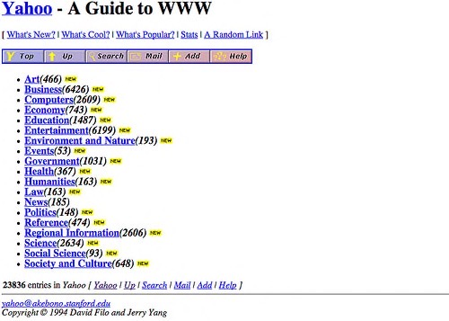
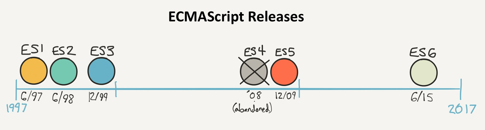

# Introdução ao JavaScript

Está na hora de conhecer o assunto principal desse livro: JavaScript!

## Uma breve história do JavaScript

JavaScript é, primeiramente e principalmente, a linguagem de programação da web. Foi inventada em 1995 por [Brendan Eich](https://pt.wikipedia.org/wiki/Brendan_Eich), que na época trabalhava para a [Netscape Communications](https://pt.wikipedia.org/wiki/Netscape), a empresa que criou o primeiro navegador web popular, também chamado Netscape.

!!! informação

    Um [navegador](https://pt.wikipedia.org/wiki/Navegador_web) é o software que você usa para visitar websites e usar aplicativos da web.

!!! aviso

    JavaScript não deve ser confundido com [Java](https://pt.wikipedia.org/wiki/Java_(linguagem_de_programa%C3%A7%C3%A3o)), outra linguagem de programação inventada na mesma época. Ambas compartilham uma sintaxe parecida, mas seu uso e princípios de design são bem diferentes.

A ideia por trás do JavaScript foi criar uma linguagem simples para fazer websites dinâmicos e interativos. Antigamente, sites eram bastante simples.

Desenvolvedores web começaram a enriquecer gradualmente seus sites adicionando código JavaScript. Para o código funcionar, o navegador recipiente (programa utilizado para navegar na web) precisava ter a capacidade de processar JavaScript. Essa linguagem tem se integrado progressivamente aos navegadores e hoje todos os navegadores conseguem processá-la.

Por causa da popularização da Web e do advento da web 2.0 (baseada em sites ricos e interativos), o JavaScript se tornou cada vez mais popular. Designers de navegadores web otimizaram a velocidade de execução do JavaScript, o que significa que hoje em dia é uma linguagem bastante rápida.

Isso levou ao surgimento da plataforma [Node.js](https://nodejs.org), que permite criar aplicações JavaScript fora do navegador. Graças ao programa chamado [MongoDB](https://www.mongodb.com/home), o JavaScript até mesmo adentrou o mundo do banco de dados(programas cuja função é armazenar informação).

Por fim, a popularidade dos smartphones e tablets com sistemas operacionais diferentes(iOS, Android, Windows Phone) levou ao surgimento das chamadas ferramentas de desenvolvimento multiplataforma. Elas te permitem criar uma única aplicação que é compatível com todos esses sistemas. Essas aplicações são quase sempre baseadas em... JavaScript!

## JavaScript: uma linguagem essencial

Resumidamente, JavaScript está em todos os lugares. Ele fica no topo de um rico ecossistema de **componentes**(pequenos blocos de programa que você pode conectar facilmente ao seu projeto) e uma comunidade vibrante de desenvolvedores. Conhecê-lo abrirá portas para programação do lado do navegador web(conhecida como desenvolvimento front-end), desenvolvimento do lado do servidor(back-end), e desenvolvimento móvel(mobile). Há quem veja o JavaScript como a tecnologia mais importante em desenvolvimento de software atualmente.

Tanto onipresente quanto relativamente fácil de aprender, o JavaScript também é uma boa escolha como primeira linguagem para aprender programação.

## Versão utilizada nesse livro

JavaScript foi padronizado em 1997 sob o nome [ECMAScript](https://pt.wikipedia.org/wiki/ECMAScript). Desde então, a linguagem passou por várias rodadas de aprimoramentos para corrigir algumas partes estranhas e comportar novos atributos.

Em 2015, as versões do JavaScript começaram a ser nomeadas por ano. O lançamento daquele ano (**ES2015**, inicialmente nomeado **ES6**), introduziu muitas novidades interessantes, várias delas foram rapidamente adotadas pela comunidade de desenvolvedores JavaScript.

Se afastando de lançamentos grandes e infrequentes, a linguagem JavaScript vêm recebendo atualizações anuais. Novos recursos de linguagem são gradualmente incorporados às plataformas JavaScript por meio de atualizações de software subsequentes. Esta é uma das razões pelas quais o seu navegador se atualiza com frequência!

Este livro é direcionado à versão **ES2016** da linguagem. Essa versão atualmente é[amplamente suportada](https://kangax.github.io/compat-table/es2016plus/) pela maioria dos ambientes e plataformas.

## TL;DR

* Originalmente criada para animar websites, a linguagem JavaScript atualmente pode ser utilizada em quase tudo, desde servidores a aplicativos móveis  e dispositivos conectados.

* JavaScript está se tornando essencial para muitos desenvolvedores de software. É uma boa escolha como primeira linguagem para aprender programação.

* A linguagem foi padronizada sob o nome **ECMAScript** e é aprimorada continuamente desde então.

* A versão do JavaScript utilizada nesse livro é a **ES2016**. É amplamente suportada pela maioria dos ambientes.